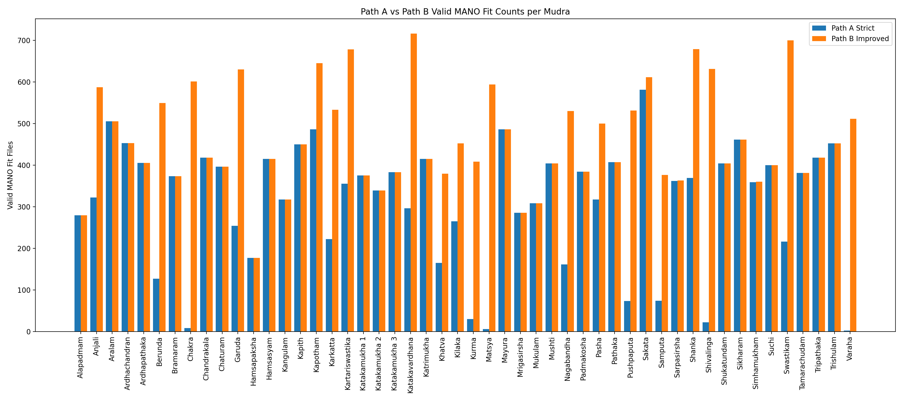
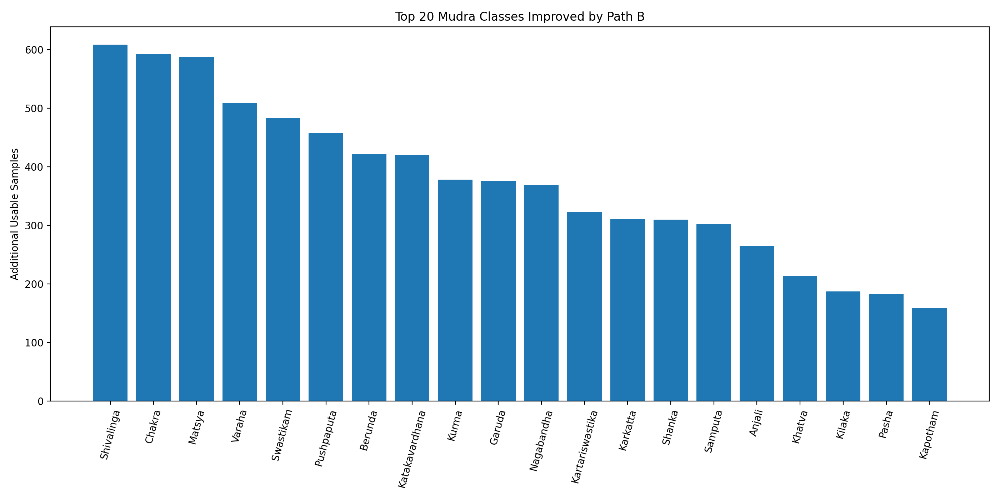

# Mudra Pose Processing Pipeline

This project builds a Bharatanatyam mudra pose-processing pipeline using MediaPipe and MANO to extract structured hand-pose representations from classical dance gesture images.

## Dataset

- Source: Bharatanatyam Mudra Dataset
- Total images processed: 28,431
- Mudra classes: 50

## Pipeline

### Stage 1: MediaPipe Landmark Extraction

- Detects up to two hands per image.
- Saves 21 hand landmarks per detected hand.
- Records extraction status and hand-count quality in a manifest CSV.

### Stage 2: MANO Fitting

- Fits SMPL-X MANO hand model parameters to detected hand landmarks.
- Produces per-image MANO fit JSON files.
- Generates canonical mudra pose lookup tables.

## Path A: Strict Baseline

Path A accepted only images where detected hand count matched the expected mudra hand count.

- Valid MANO fit files: 15,562
- Usable coverage: 54.7%
- Output folder: data/mano_fits_20iter_baseline/

## Path B: Improved Coverage

Path B accepted any image with at least one detected hand and preserved hand-count quality metadata.

- Valid MANO fit files: 23,054
- Usable coverage: 81.1%
- Improvement over Path A: +7,492 samples
- Output folder: data/mano_fits_pathB_20iter/

## Key Result

Path B improved usable sample coverage from 54.7% to 81.1% by supporting partial two-hand detections instead of rejecting them as wrong-hand-count samples.

## Visual Results

### Path A vs Path B Valid MANO Fit Counts

### Top 20 Mudra Classes Improved by Path B

## Key Outputs

- results/canonical_poses_20iter.json
- results/canonical_poses_pathB_20iter.json
- results/landmark_manifest.csv
- results/landmark_manifest_pathB.csv
- results/mano_fit_summary_20iter_clean.csv
- results/mano_fit_summary_pathB_20iter.csv
- results/figures/pathA_vs_pathB_valid_counts.png
- results/figures/top20_pathB_gains.png
- results/README_results.md

## Engineering Fixes

- Fixed legacy Chumpy compatibility by pinning NumPy to 1.23.5.
- Patched MANO fitting to handle SMPL-X MANO's 16-joint output against MediaPipe's 21 hand landmarks.
- Added Path B extraction logic to retain partial two-hand detections while tracking quality metadata.

## Environment

- Python 3.10
- NumPy 1.23.5
- OpenCV 4.8.1
- MediaPipe
- PyTorch
- SMPL-X / MANO
- Chumpy 0.70

## Reproduction

Activate environment:

    conda activate mudra

Run Path B landmark extraction:

    python 01_extract_landmarks.py --raw_dir data/raw --out_dir data/landmarks_pathB --model_path models/hand_landmarker.task

Run MANO fitting:

    python 02_fit_mano.py --landmarks_dir data/landmarks_pathB --mano_dir models/mano --out_dir data/mano_fits_pathB_20iter --n_iters 20 --loss_threshold 0.05

Generate visualizations:

    python 03_visualize_pathA_vs_pathB.py

## Project Summary

Built a Bharatanatyam mudra pose-processing pipeline over 28,431 images using MediaPipe and MANO, improving usable landmark coverage from 15,562 to 23,054 samples by adding partial two-hand detection support; patched SMPL-X MANO fitting to align 16-joint MANO output with 21-point MediaPipe landmarks and generated canonical pose embeddings for 50 mudra classes.
